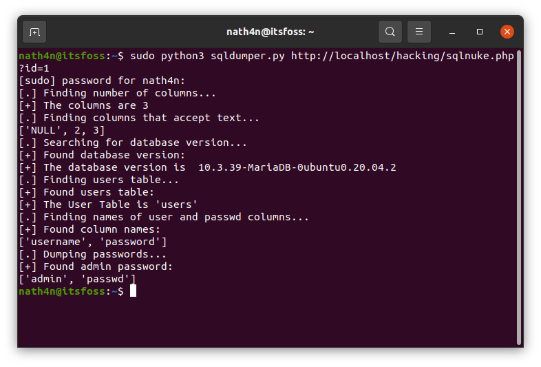

# SQL dumper

Lab: SQL injection UNION attack, determining the number of columns returned by the query
Lab-Link: https://github.com/frank-leitner/portswigger-websecurity-academy/tree/main/01-sqli/Blind_SQL_injection_with_conditional_responses
Difficulty: PRACTITIONER  
Python script: [sqldumper.py](sqldumper.py)

